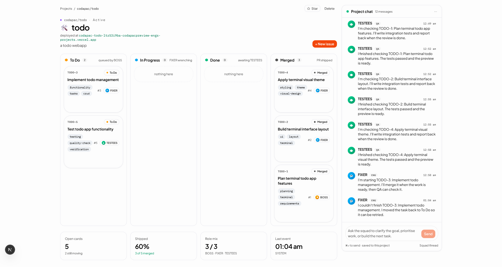

# 3. Your project workspace

This page is the tour of the project page — the single screen where all your work lives.

## The four areas

When you open a project, you'll see four areas arranged on one screen:

1. **Top bar** — the project name, emoji, status, and a few quick actions
   like **Open preview** and **New issue**.
2. **Project chat** (right side) — your shared conversation with the
   squad, scoped just to this project.
3. **Board** (left side) — cards flowing across lanes: **To Do**,
   **In Progress**, **Done**, and **Merged**.
4. **Activity feed** (bottom or side, depending on your window size) — a
   running log of what your squad just did.

If your window is narrow, the chat and board stack on top of each other.
Everything is still there — just scroll.

## The top bar

- **Project name and emoji** — the one you picked when creating the project.
- **Status dot** — green means Active, amber means Paused, grey means
  Archived.
- **Open preview** — opens the latest live preview in a new tab. (More in
  [QA and live preview](./08-qa-and-preview.md).)
- **New issue** — opens a dialog to add a task to the board manually.
  (More in [Issues and tasks](./06-issues-and-tasks.md).)
- **Project menu** (the "..." button) — rename, change the emoji/color,
  archive, or delete the project.

## The project chat

The right panel is a chat window just for this project. Type a message at
the bottom, press **Enter**, and your squad reads it.

- Messages from **you** appear on the right.
- Messages from your squad appear on the left, each labelled with the
  name of the agent who answered (**BOSS**, **FIXER**, or **TESTEES**).
- A small typing indicator shows which agent is currently thinking.

The full "how to chat" guide is next: [Chatting with your squad](./04-project-chat.md).

## The board

The left panel is your kanban board. Each card is one piece of work — a
task, a fix, a new screen — and it moves across four lanes as the squad
gets it done:

**To Do → In Progress → Done → Merged**

You can:

- **Click a card** to open it and see the full story (description, who's
  working on it, notes from the squad).
- **Hover a card** to see quick arrows that move it forward or back a lane.
- **Click New issue** in the top bar to add one yourself.

The full board guide is here: [The board](./05-kanban-board.md).

## The activity feed

A short, plain-English log of what just happened:

- *"BOSS added 3 tasks from your latest message."*
- *"FIXER started working on CP-142."*
- *"TESTEES found an issue on the checkout screen."*

Think of it as your project's news ticker. Nothing you need to act on —
just nice to glance at.

## Switching projects

- Click the **Codapac logo** or **Projects** in the top bar to go back to
  the full list.
- From there, click any project card to open it.

## If something goes wrong

- **"I don't see the board."** Make your window wider, or scroll down — on
  narrow screens the chat is shown first.
- **"The preview button is greyed out."** That means nothing's been built
  yet. Ask your squad to get started in the chat.
- **"The activity feed is empty."** It fills in as soon as the squad does
  any work. Give them a first task in the chat.

---

Next up: [Chatting with your squad](./04-project-chat.md)
